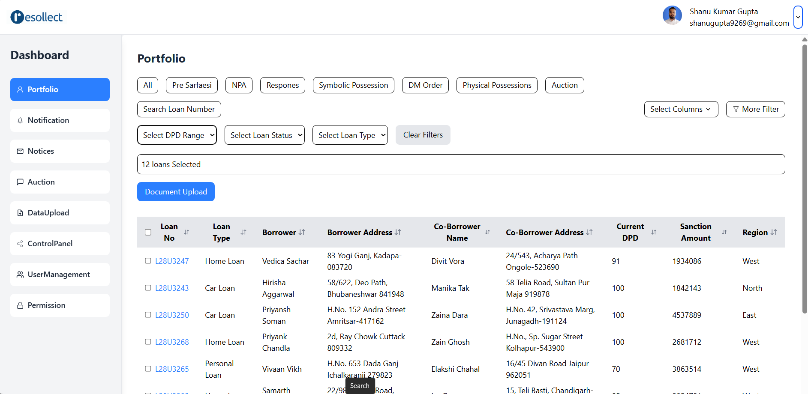
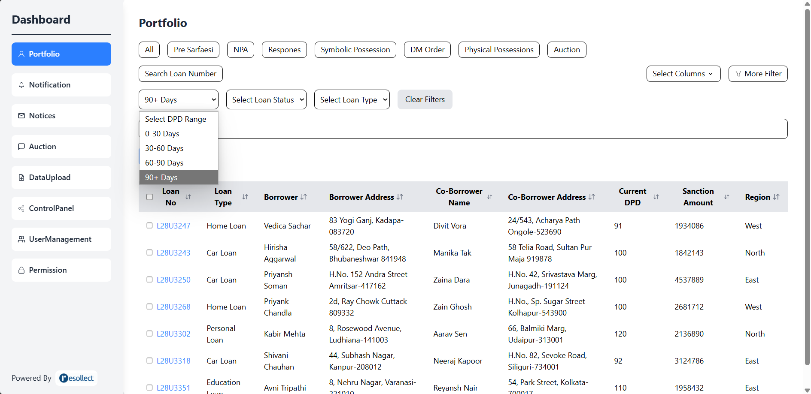
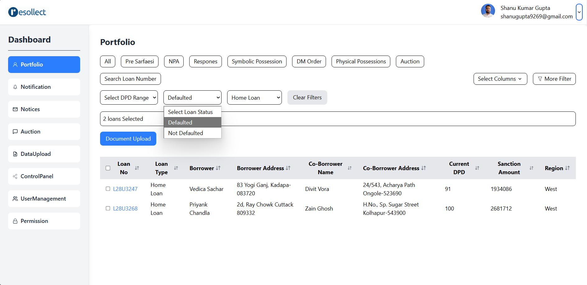
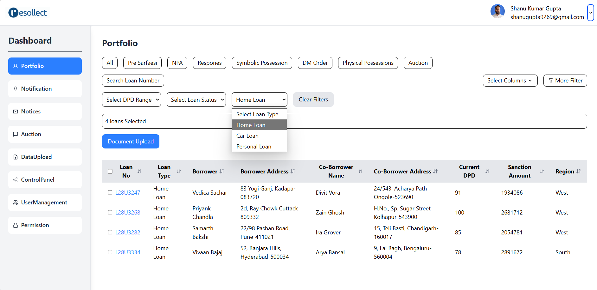

# React Dashboard Application 📊

A comprehensive and modular **React Dashboard Application** built with **ReactJS**, **Tailwind CSS**, and **React Icons**. The project is structured to ensure readability, reusability, and easy maintenance.

---

## 🔥 Features
- Modularized Code Structure for easy understanding.
- Dynamic **Loan Data Table** with sorting and filtering.
- **Sidebar Navigation** with different dashboard sections.
- **Document Upload Modal** for uploading files.
- Responsive UI with **Tailwind CSS** for a sleek design.

---

## 🔧 Technologies Used
- Frontend: ReactJS, Tailwind CSS, React Icons

- Backend: Node.js, Express.js

- Styling: Tailwind CSS for responsive design

- Data Handling: JSON for mock data

- File Upload: HTML5 file input with Express.js for uploads

---

## 📂 **Project Structure**
```bash
Resollect Project/
├── Frontend/                     # React frontend
│   ├── public/                 # Public static files 
│   ├── src/                    # React source files
│   │   ├── App.js              # Main React component
│   │   ├── index.js            # React entry point
│   │   ├── assets/             # Asset folder for images
│   │   │   └── ResollectIcon.png
│   │   ├── data/               # Contains JSON data files
│   │   │   └── loans.json
│   │   ├── Components/         # Reusable React 
│   │   │   ├── Dashboard.jsx   # Dashboard component
│   │   │   └── Header.jsx      # Header component for UI
│   └── package.json            # Client-side dependencies 
└── README.md                   # Project documentation

```
---

## 📄 Folder Details

 **Frontedn/src/**
- App.js - Main application component.
- index.js - Entry point for rendering the React app.
- assets/ Contains images like ResollectIcon.png for UI.
- data/ JSON data files like loans.json to simulate API data.
- Components/ Dashboard.jsx - Renders the main dashboard view.
- Header.jsx - Displays the application header with navigation.

--- 

## 🚀 Getting Started
- Step 1: Clone the Repository
    git clone https://github.com/your-username/react-node-dashboard.git

- Step 2: Install Dependencies
    For the Frontend
    cd Frontend
    npm install

- Step 3: Run the Application
    Start the Frontend
    cd Frontend
    npm run dev

- Runs on localhost:3000

---

## 📸 Project Screenshots

### Screenshot 1: First


### Filtering The Data

- ### Screenshot 1: First


- ### Screenshot 2: Second


- ### Screenshot 3: Third


---

## 🗂️ Sample Data (/client/src/data/loans.json)
  {
  "loans": [
    {
      "Loan No": "L28U3247",
      "Loan Type": "Home Loan",
      "Borrower": "Vedica Sachar",
      "Borrower Address": "83 Yogi Ganj, Kadapa",
      "Co-Borrower Name": "Divit Vora",
      "Co-Borrower Address": "24/543, Acharya Path Ongole",
      "Current DPD": 91,
      "Sanction Amount": 1934086,
      "Region": "West"
    }
  ]
}

---

## 💡 Future Enhancements
- Integrate a real database like MongoDB for data persistence.

- Implement user authentication for secure access.

- Add data visualization with libraries like Chart.js or Recharts.


---
## 🤝 Contribution

- Fork the repository.

- Create a new branch: git checkout -b feature-branch.

- Commit your changes: git commit -m "Add new feature".

- Push to the branch: git push origin feature-branch.

- Submit a pull request!

---
## 📄 License
- This project is licensed under the MIT License.

---
## 📧 Contact
- For any inquiries or support, reach out to:
- Email: shanugupta8269@gmail.com
- GitHub: shanugupta7999

